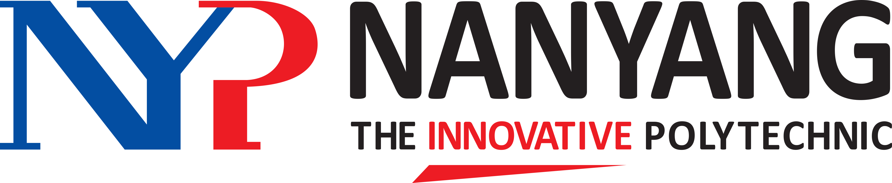

# Vending-Machine

<h1 align="center">
    
     
    Vending Machine
     
    (Python Programming Assignment)
</h1>

## Nanyang Polytechnic Y1 Programming Essentials Project
Python Programming Assigment after learning Python for the first time.

**Project Description:**

>Y1 of Cybersecurity & Digital Forensics in NYP consists of the module Programming Essentials, where we learn basic Python Programming and how to apply it
>
>This project consists of us creating a Vending Machine using Python, where the admin gets to update the store and users can buy drinks 

## Features
1. Update Vending Machine
    - Add a completely new Product
    - Edit Stock of a certain product
    - Edit Quantity of a certain product

2. Purchasing Products from Vending Machine
    - Users can select product to purchase
    - Users can select stock to purchase
    - Users can input amount they would like to pay and receive change

3. Error Handling
    - Handling Input Errors

4. User Friendly Interface
    - UI is very user friendly

---
### Additional Feature

- Password 
    - Admins required to enter password before abling to edit the inventory

## Notes

Assignment is for educational purposes

Made when I just started learning Python

Python Project is no longer being updated
